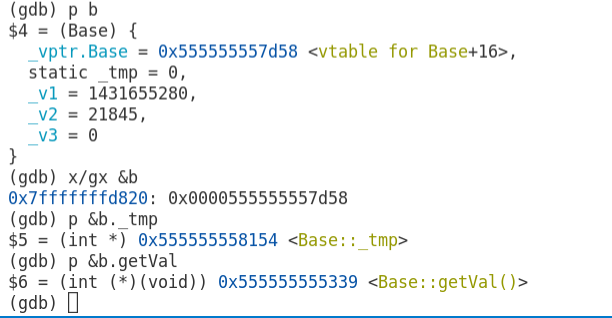
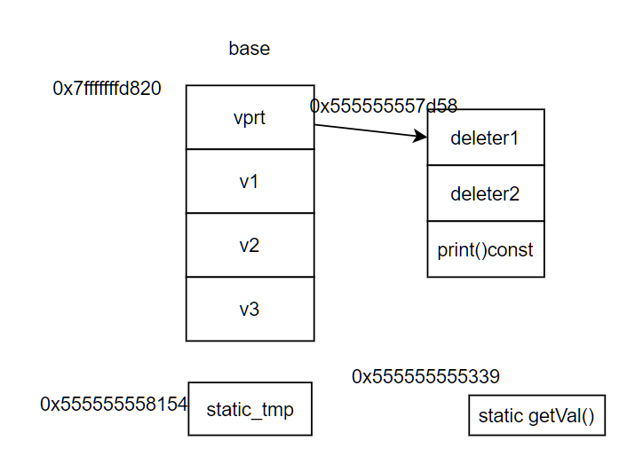
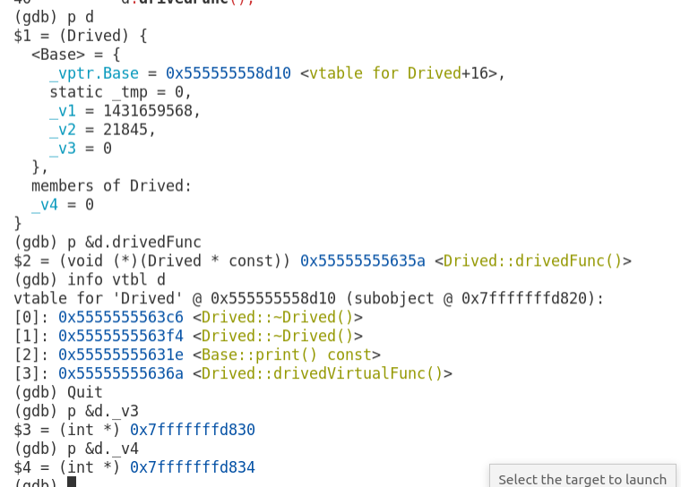
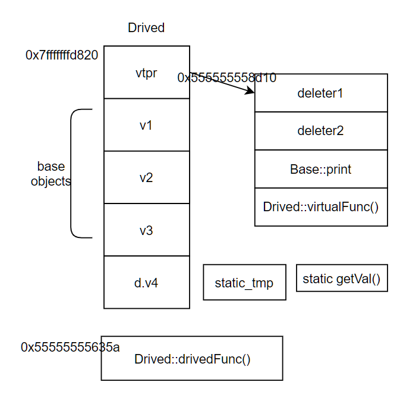
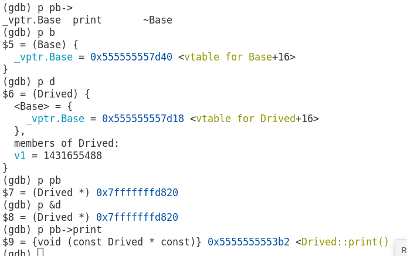
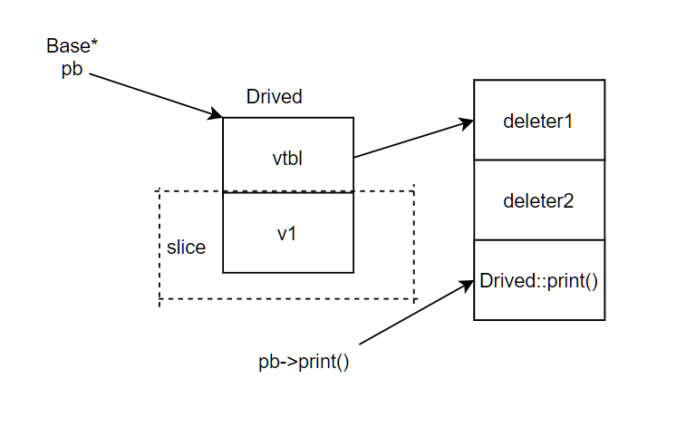

### c++几种常见的模型
不包括什么多继承，虚继承。
##### 无继承但有虚函数
```c++
#include <bits/stdc++.h>
using namespace std;

class Base
{
public:
    virtual ~Base() {}
    virtual void print() const
    {
        cout << "base" << endl;
    }
    static int getVal()
    {
        return _tmp;
    }

protected:
    static int _tmp;
    int _v1;
    int _v2;
    int _v3;
};

int Base::_tmp = 0;

int main(int argc, char **argv)
{
    Base b;
    b.getVal();
    return 0;
}
```
gdb打印结果：

可得出以下模型：


为什么gcc有两个析构函数呢：
>一个叫complete object destructor, 另一个叫deleting destructor，区别在于前者只执行析构函数不执行delete()，后面的在析构之后执行deleting操作。应该是gcc想把non-detele的析构函数轮一遍后，然后用delete析构直接就清理掉整个内存。
<https://www.zhihu.com/question/29257977/answer/80930075>

##### 单一继承无覆写重载隐藏
```c++
#include <bits/stdc++.h>
using namespace std;

class Base
{
public:
    virtual ~Base() {}
    virtual void print() const
    {
        cout << "base" << endl;
    }
    static int getVal()
    {
        return _tmp;
    }

protected:
    static int _tmp;
    int _v1;
    int _v2;
    int _v3;
};

class Drived : public Base
{
public:
    void drivedFunc() {}
    virtual void drivedVirtualFunc() {}

protected:
    int _v4;
};

int Base::_tmp = 0;

int main(int argc, char **argv)
{
    Base b;
    Drived d;
    d.drivedFunc();
    return 0;
}
```
gdb调试如下：

可视化：


##### 单一继承虚函数的覆写
```c++
#include <bits/stdc++.h>
using namespace std;

class Base
{
public:
    virtual ~Base() {}
    virtual void print() const
    {
        cout << "base" << endl;
    }
};

class Drived : public Base
{
public:
    virtual ~Drived() {}
    virtual void print() const override
    {
        cout << "drived" << endl;
    }
    void func() {}
    int v1;
};

int main(int argc, char **argv)
{
    Base b;
    Drived d;
    Base *pb = &d;
    return 0;
}
```
gdb截图：

模型可视化:

仅通过Base的指针显然不能访问v1，相当于Drived的数据部分被slice掉了，而pb指向Drived的虚函数表里的print是Drived的print，而不是Base的print，故而在运行时会执行Drived的print。
##### 隐藏与重载
```c++
#include <bits/stdc++.h>
using namespace std;

class Base
{
public:
    void func()
    {
        cout << "Base" << endl;
    }
    void func(int a) {}
    //int func() {}
};

class Drived : public Base
{
public:
    void func(int a, int b)
    {
        cout << "Drived" << endl;
    }
};

int main(int argc, char **argv)
{
    Base b;
    Drived d;
    Base *pb = &d;
    b.func();
    //d.func(); error: no matching function for call to ‘Drived::func()’
    d.func(1, 2);
    pb->func();
    //pb->func(1, 2);error: no matching function for call to ‘Base::func(int, int)
    return 0;
}
```
类的重载与普通的函数重载规则相同。
这里Drived的func隐藏了Base的func，因此直接通过Drived是不能访问Base的func的。除非显示的指明base：d.Base::func()或d.Base::func(int)